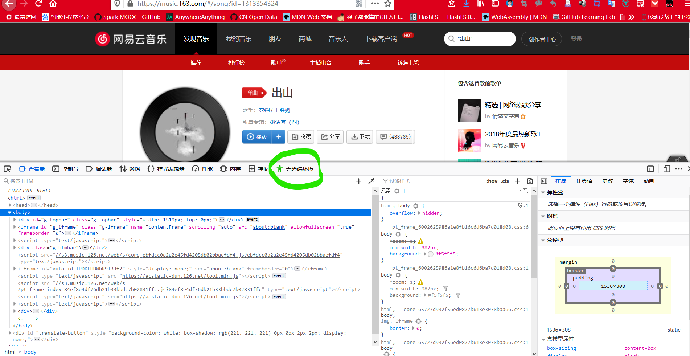
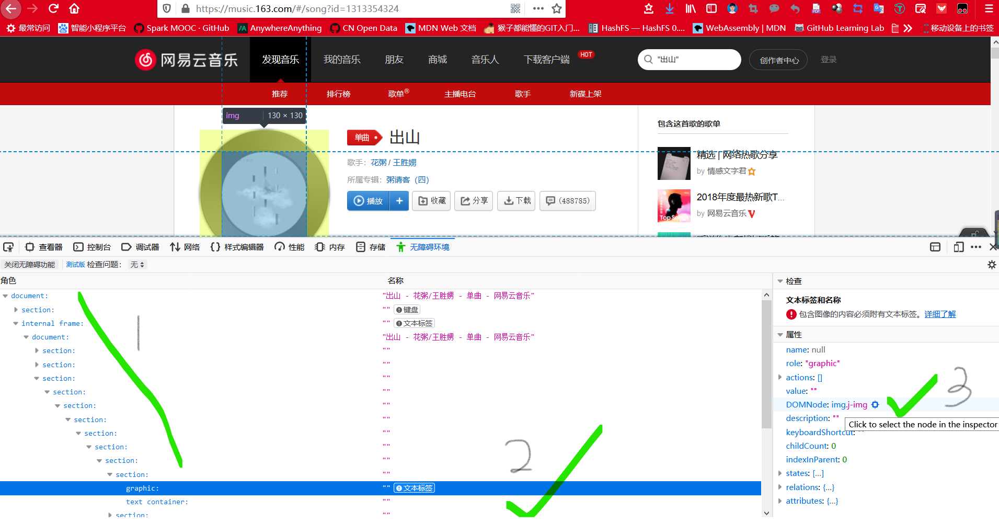
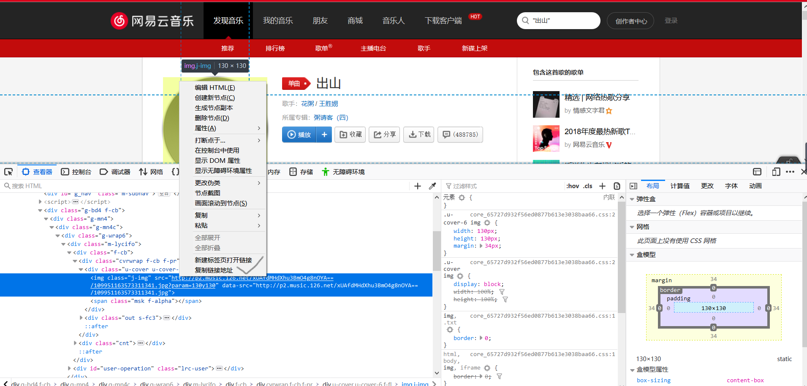

# music

## 在主页添加自定义音乐播放

在 `themes/hexo-matery/source/medias/` 目录下创建 `music/` 目录，并将需要的音乐放进入；接着修改文件 `docs/source/_data/musics.json`。比如：

```json
{
    "name": "出山",
    "artist": "花粥",
    "url": "/medias/music/出山.mp3",
    "cover": "/medias/music/avatars/chushan.jpg"
}
```

其中 `"name"`，`"artist"`，`"cover"` 分别表示歌曲名字，歌者，封面。歌曲的封面的获取可以使用如下方法（firefox 浏览器）：

首先，进入网易云音乐的网页：<https://music.163.com/>，搜索您想要的歌曲，比如："出山"，然后按键 `F12`，弹出如下界面：



接着选择 `无障碍环境`，然后按照下图指示找到 `DOMNode:img.j-img` 并用鼠标点击：



接着，可在下图的对应位置找到封面的链接：



最后，将链接的 `?param=130y130` 部分删除，便可直接保存封面图片了。
